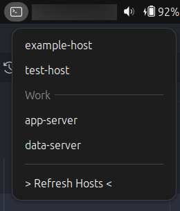

# GuakeSSH

 

## Description

GuakeSSH is a GNOME extension that allows you to show SSH connections from .ssh/config file directly from the GNOME panel systray. With this extension, you can easily access your configured SSH hosts from a dropdown menu and connect in the [Guake Terminal](https://guake.github.io/).



## Usage

After installation, you will see a new icon in the GNOME panel. Click the icon to view your configured SSH connections in ```.ssh/config``` or any files in ```.ssh/config.d/```. You can click on a host to connect via Guake Terminal SSH.

- **Left mouse click:** new tab
- **Right mouse click:** split vertical current tab
- **Middle mouse click:** split horizontal current tab

When it's a new tab, by default, the tab title will be the hostname. You can disable this option in the extension settings.

### Hiding SSH Config files on .ssh/config.d

If you want a file inside `config.d` to not be listed in the menu, you can either append the word `hide` to the end of the file name or add `#ignore-file` as the first line of the file.

### Hiding SSH Connections

If you want to hide an SSH connection from the dropdown menu, add `#hide` at the end of the Host line in your `.ssh/config` file. For example:

```ssh-config
Host example-host #hide
   HostName example.com
   User username
```

## Installation

### Installation from Gnome Extensions

[](https://extensions.gnome.org/extension/8012/)

### Installation from GitHub repository

1. Clone this repository:

   ```shell
   git clone https://github.com/pramalho/guake-ssh-extension
   ```

2. Navigate to the extension directory:

   ```shell
   cd guake-ssh-extension
   ```

3. Install the extension:

   ```shell
   npm install
   npm run setup
   ```

4. Enable the extension via GNOME Tweaks or the GNOME Extensions interface.

## Contribution

Contributions are welcome! Feel free to open issues or pull requests.

## FAQ

### I don't know how to load/import the files in .ssh/config.d?
For those who don't know how to load/import the `.ssh/config.d` files into the main `config` file, you just need to add the following line to the `.ssh/config` file:  

```ssh-config
Include config.d/* 
```

## License

This extension is licensed under the [MIT License](LICENSE).

